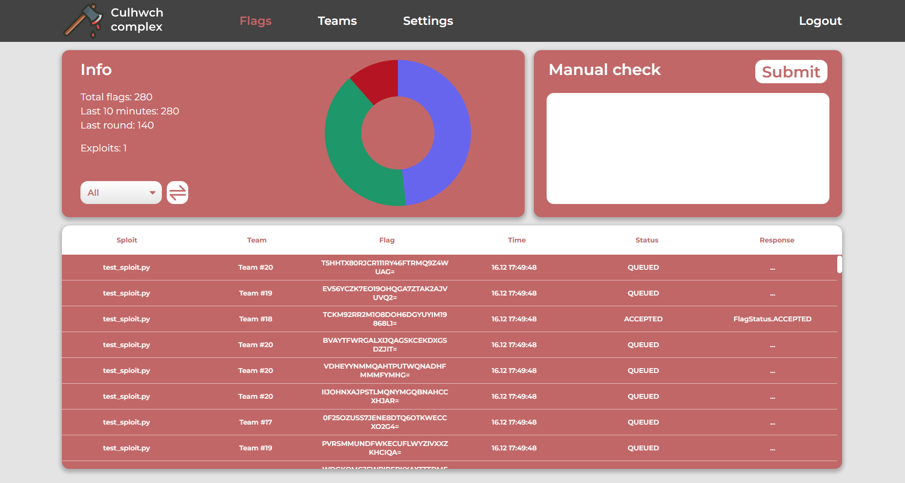
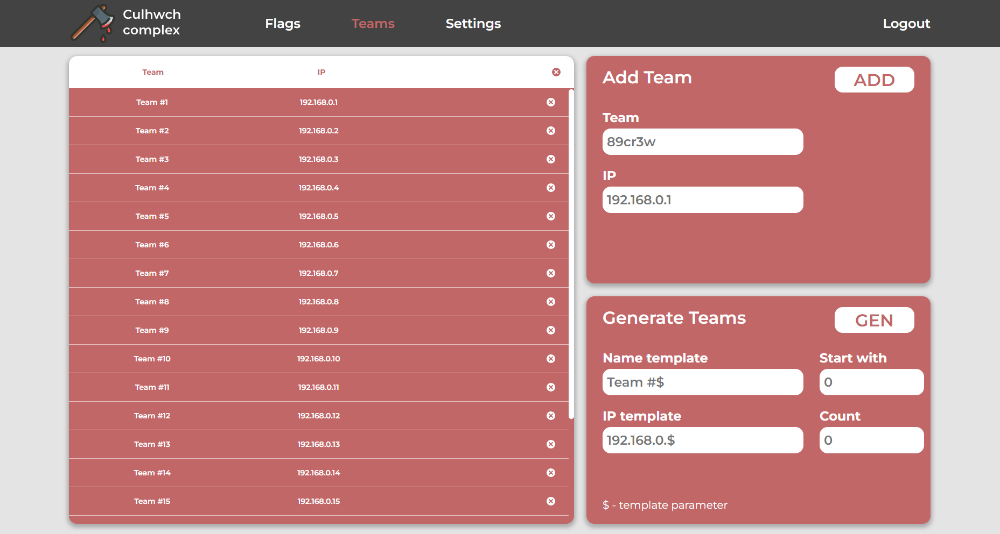
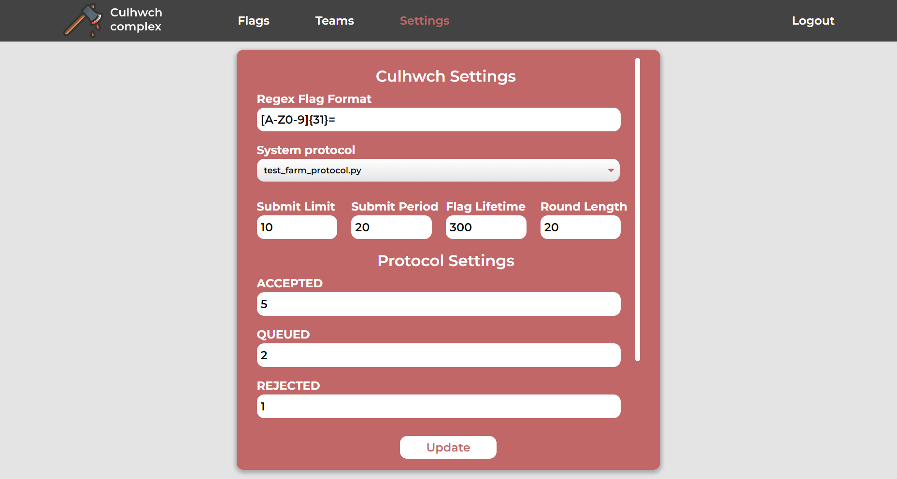

# CulhwchFarm

    Language: <a href="https://github.com/arkiix/CulhwchFarm/blob/main/README.md">English</a> | <b>Русский</b>

CulhwchFarm - это гибкая и удобная ферма для Attack/Defense CTF. Вдохновлено: [DestructiveFarm](https://github.com/DestructiveVoice/DestructiveFarm), [S4DFarm](https://github.com/C4T-BuT-S4D/S4DFarm).

## Running
- Смените пароль в [compose.yml](../compose.yml). (SERVER_PASSWORD)
- Выполните `docker compose up --build -d` или `make start`
- После билда ферма будет доступна на http://localhost:8893

## Scripts
Возможности фермы настраиваются и расширяются скриптами: протоколами, валидаторами. 

При необходимости добавления в скрипт параметров, первая строчка должна содержать комментарий с ними, например, `# params: SYSTEM_HOST, SYSTEM_PORT`. Настройка этих параметров будет доступна из веб-интерфейса, а скрипт может их получить из config'а, например, `host = config.get('SYSTEM_HOST')`.

Culhwch отлавливает изменения скриптов автоматически и обрабатывает их при открытии настроек в веб-интерфейсе.

### Protocols
Для работы фермы с журейной системой (сдачи флагов) используются [протоколы](../server/api/protocols). В протоколе должна быть реализована функция `submit_flags(flags: list[Flag], config: dict)`, возвращающая генератор.
### Validators
Для фильтрации и изменения флагов на входе в ферму используются [валидаторы](../server/api/validators). В валидаторе должная быть реализована асинхронная функция `async def validate_flags(flags: Iterator[Flag], app, config: dict)`, возвращающая асинхронный генератор.

## Веб-интерфейс
### Flags
На странице Flags доступна статистика по сплоитам и возможность сдать флаг вручную.

### Teams
На странице Teams можно управлять командами:
- Удаление команд
- Добавление команд
- Генерация команд
  

### Settings
На странице Settings можно управлять настройками фермы:
- Настройка стандартных переменных
- Выбор протокола и настройка его параметров
- Включение/отключения валидаторов и настройка их параметров
  

## API
API фермы позволяет автоматизировать некоторые задачи, например, управлять настройками, списком команд (пример, [team_parsers](../client/team_parsers)).

## Exploits
Для атаки вражеских команд пишутся эксплоиты, которые крадут флаги и отправляют их на ферму

Для запуска эксплоита используется [start_sploit.py](../client/start_sploit.py), пример:
> python3 start_sploit.py sploit.py
